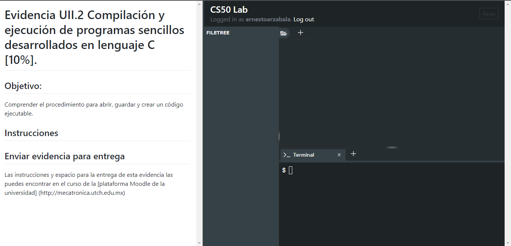
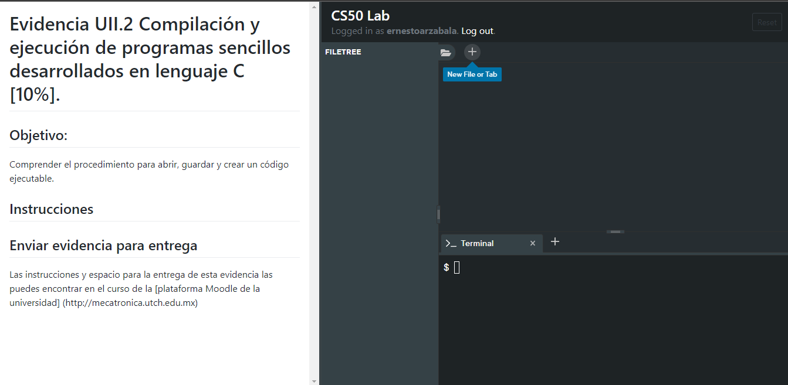
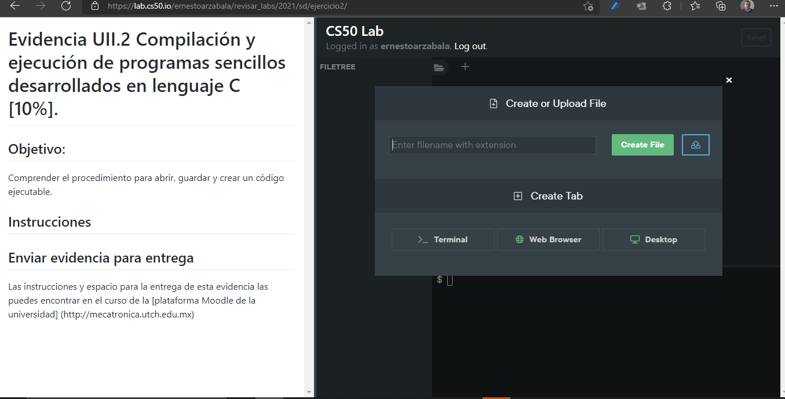
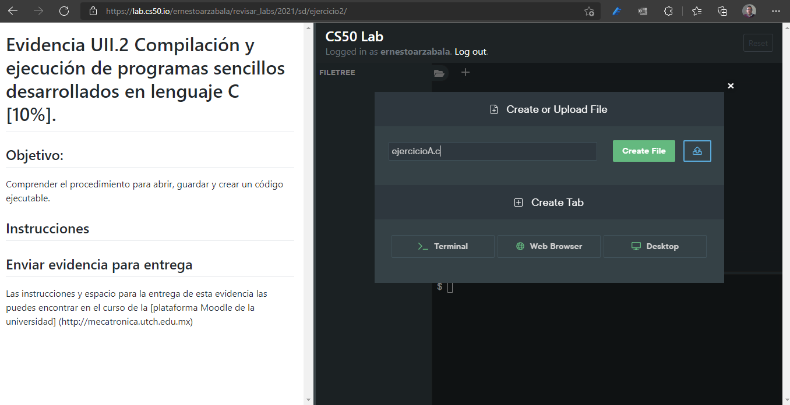
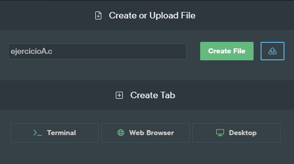
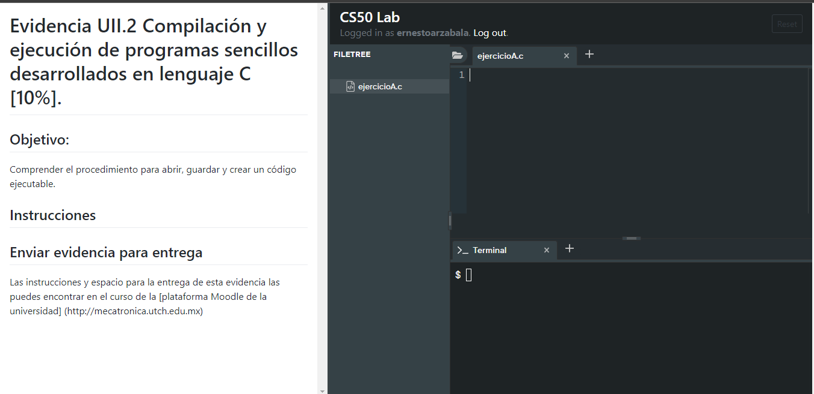
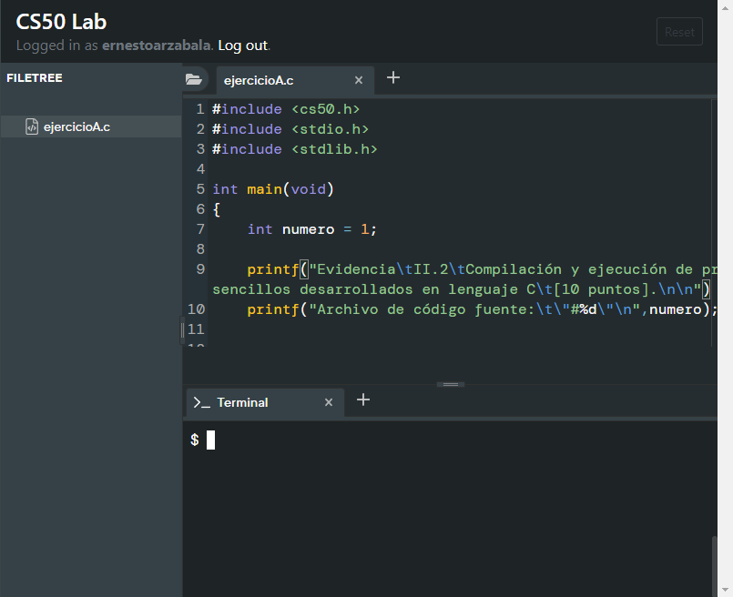
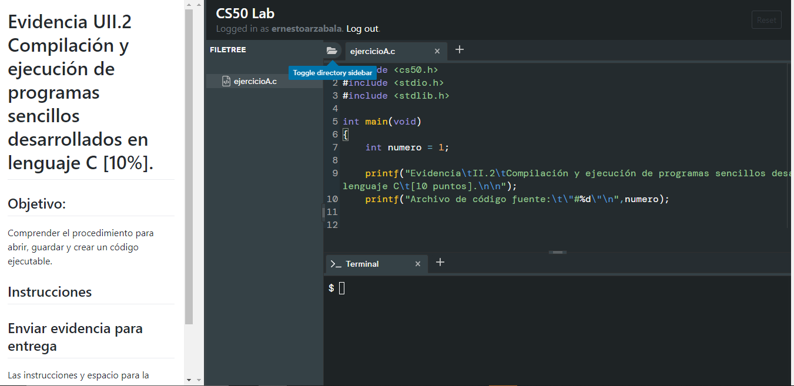
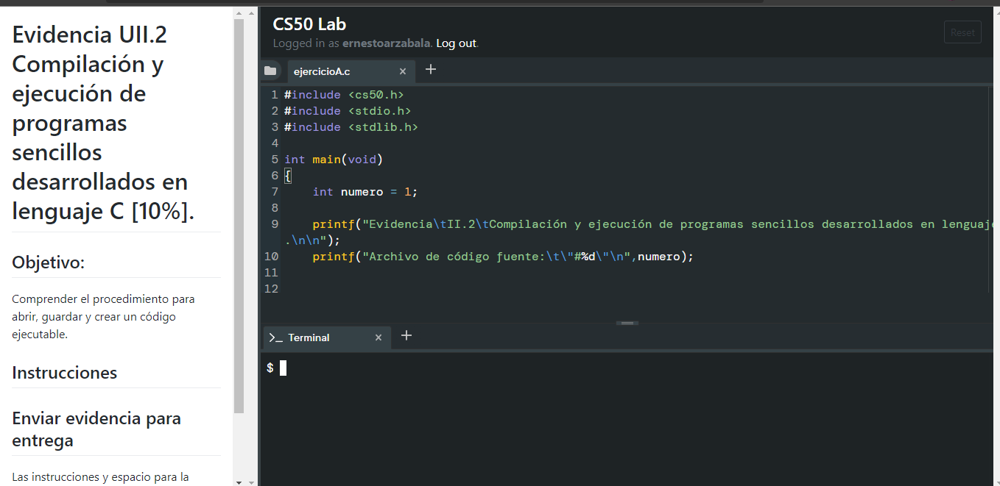

# Evidencia UII.2 Compilación y ejecución de programas sencillos desarrollados en lenguaje C [10%].

## Objetivo: 

Comprender el procedimiento para abrir, guardar y crear un código ejecutable.

## Instrucciones

1. Al iniciar su ambiente (CS50 Labs/ Sandbox) aparece sin un archivo en el editor de texto y sin ningún archivo en la carpeta, tal como se muestra en la siguiente imagen:



2. Hay que crear un nuevo archivo de texto que contendrá el código fuente del primer ejercicio. Para crear un nuevo archivo hay que presionar el símbolo + tal como se muestra en la siguiente imagen:



3.  Nos pedirá asignarle un nombre y una extensión. Recuerde que los archivos de texto que contienen el código fuente de los programas desarrollados en lenguaje C tienen la extensión .c .



4. Asignele el nombre ejercicioA y la extensión .c tal como se muestra en la siguiente imagen:



5. Presione el botón de "Create File" para crear su archivo de texto que contendrá el código fuente del programa.



6. Una vez que ha creado el archivo el ambiente (CS50 Labs / CS50 Sanbox) se mostrará de la siguiente manera:



7. En el editor de texto copie el siguiente texto de código fuente:

```c
#include <cs50.h>
#include <stdio.h>
#include <stdlib.h>

int main(void)
{
    int numero = 1;
    
    printf("Evidencia\tII.2\tCompilación y ejecución de programas sencillos desarrollados en lenguaje C\t[10 puntos].\n\n");
    printf("Archivo de código fuente:\t\"#%d\"\n",numero);
    

    return EXIT_SUCCESS;
}
```

Debe de quedar de la siguiente manera:



8.



9.


10.




11. Para compilar el archivo de código fuente necesita escribir el siguiente comando en la ventana de "Terminal"

```
clang -Wall ejercicioA.c -o ex1
```
[captura de pantalla de CS50 Labs / CS50 Sanbox](EVII_img11.png)


## Enviar evidencia para entrega

Las instrucciones y espacio para la entrega de esta evidencia las puedes encontrar en el curso de la [plataforma Moodle de la universidad] (http://mecatronica.utch.edu.mx)